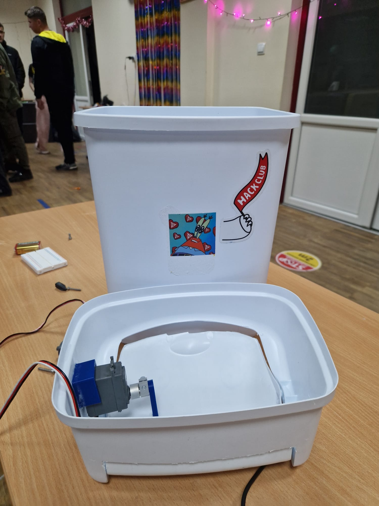

## The talking bin

This project attempted to make a talking bin. It listens for the user's input, and it talks back in a funny manner.
It uses the lamma model trough hackclub's ai api, and eleven labs speech synthesis to play the text that is coming from the ai.
Then the plan was to move the lid of the bin to mimic the bin talking back.