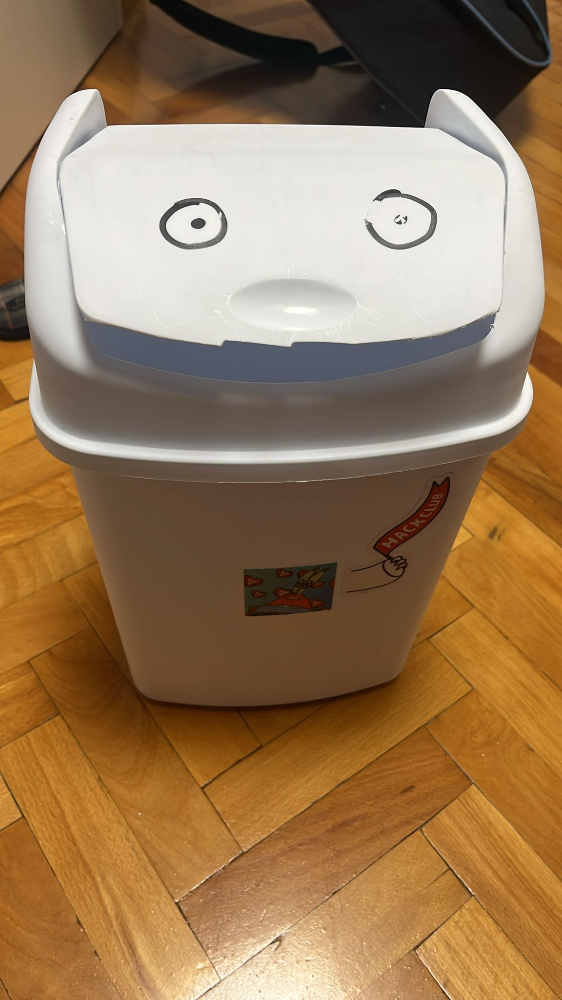

## ChatterBin

  
  

The main goal of this project was to convert an average trash can into an stupid (and slightly saucy) interactive thingmabob which you can talk with. It uses the Llama AI model through Hackclub's AI API, and Eleven Labs speech synthesis to vocalize the resulting text output. The plan was to make the lid move so that it looked like ChatterBin was talking back. We were hoping to make several sequences of angles of motion (of the lid), which would then be randomly selected and sent to the servo until the voice stopped, at which point the lid would return to position "0". The laptop provides both the input and ouput and connects to the ESP via WiFi.The ESP8266 was stored inside the trash can itself and powered using a power bank, while the servomotor was connected to the ESP and we were going to connect its power to a 9V battery, as the standard 3v3 pin that the ESP has could not provide enough power for the servo. As can be roughly seen from the above pic, the servo is held by a 3D printed mount glued to the side of the top half of the bin directly under the lid's axle, and the servo arm was to be attached to the lid above with M3 screws, but we ran out of time and tried to glue it, which unfortunately didn't hold. The servo mount is at an angle to compensate for the angle of walls of the upper half of the bin.

[Onshape document.](https://cad.onshape.com/documents/9de98d6fef281e4f1185fb6c/w/84ab5ef6db506a274d8ced64/e/0f7f177f9f54804ed41bfc09)

